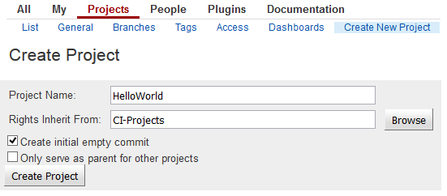
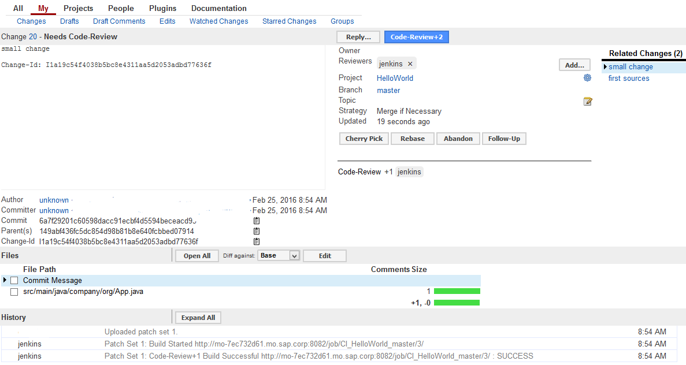

---

title: Continuous Integration (CI) Best Practices with SAP: Generic Project
description: Part 4.1: Configuring the CI system for Maven-based generic Java project.
primary_tag: tutorial>intermediate
tags: [  tutorial>intermediate, tutorial:type/project ]

---

## Prerequisites

  - **Proficiency:** Intermediate
  - [Landscape Configuration](http://go.sap.com/developer/tutorials/ci-best-practices-landscape.html)

## Next Steps

  - [Back to the Navigator](http://go.sap.com/developer/tutorials/ci-best-practices-intro.html)

---


We will start by setting up the CI process for a pure Java project without any deployment. The build tool of choice is Maven. So on the local developer host, a Maven installation is a prerequisite. The general procedure is the following: first, a project in Gerrit is created together with the first branch, the main integration branch master. Then the (initially empty) repository is cloned on a local developer workplace, code is committed and pushed as a first commit in Gerrit. As the next step, a build voter is configured with Jenkins.

#### Prerequisites

- There is a developer workplace (PC) with the following installations:
    - Java JDK
    - Git
    - Maven
    
- Running Git/Gerrit instance
- Running Jenkins Master and a Jenkins build slave 
- Running Nexus with at least one snapshot repository


Eclipse as development environment is commonly used but not absolutely needed and not regarded as prerequisite in this guide.


### Basic Project Setup

#### Procedure

1. Access the Gerrit front end with a browser on port 8080 and log on with your admin user.

2. Go to **Projects > Create New Project**. 

3. Enter the project name `HelloWorld` and select **Create initial empty commit**. This automatically creates the master branch.

4. Enter `Rights Inherit From:` `CI-Projects`.

      
 
    Alternatively, you may follow the steps for command line-based creation as described in:  
    
    > Documentation: https://gerrit-review.googlesource.com/Documentation/cmd-create-project.html
    
5. Do an initial clone of the project to your PC and check out the `master` branch.

6. On your local PC, for being able to push commits to Gerrit, you have to add a commit hook into the
    `{Git repository root}/.git/hooks` directory. It can be obtained through `http://<hostname of Gerrit>:8080/tools/hooks/commit-msg`.
    Every developer who plans to do commits against Gerrit needs this hook.
     
    > Documentation: https://git.eclipse.org/r/Documentation/cmd-hook-commit-msg.html
    
7. Add the initial project files into the Git workspace.
    For example, add the following files with the content taken from the appendix:

    ```
    {Git repository root}/pom.xml
    {Git repository root}/src/main/java/company/org/App.java
    {Git repository root}/src/test/java/company/org/AppTest.java
    ```

8. Create a commit and push:

    ```
    git add .
    git commit -m "Initial version of HelloWorld"
    git push origin master:refs/for/master
    ```

9. In Gerrit, the commit should be listed under **My > Changes**. 

10. Give the commit a `Code-Review+2 and **Submit**.
    Now the commit is merged into the master branch.


### Jenkins Voter Build

Yet there is no Jenkins voter build configured for this branch. The global configurations are done, so now we will define the job.

#### Procedure

1. Open the Jenkins front end and go to `**New Item** and select **Maven project**.

2. Enter a project name like `VO_HelloWorld_master`.
    In principle, the name does not play a technical role except for identifying the job, but keep in mind that over time you might have to differentiate many jobs by Gerrit project name, branch, or other purposes (like the prefix `VO` for "voter build"). A naming convention is helpful.

3. In the project configuration, enter the following data:  

    Field                                    | Value
    :--------------------------------------- | :------------------------------------------------------------------------
    Restrict where this project can be run   | `checked`; Label Expression: the label that you have assigned to the slave, in this case `builds`
    Source Code Management                   | `Git`
    Git                                      | `checked`
    Repository URL                           | `{the ssh based URL of your repository}`
    Credentials                              | `jenkins`, Click on **Advanced...**
    Ref spec                                 | `refs/changes/*:refs/changes/*`
    Branches to build; Branch Specifier      | `$GERRIT_REFSPEC` (this might be unintuitive, but works according to the official documentation)
    Build Triggers                           |
    Gerrit Event                             | `checked`
    Gerrit Trigger                           |
    Choose a server                          | `{the Gerrit server you already have defined in Jenkins}`
    Trigger on                               |
    Add                                      | `Patchset Created`
    Gerrit Project                           | Plain: `HelloWorld`; Branches Plain: `master`
    Build                                    |
    Goals an options                         | `clean install`

    Now the Jenkins project is ready to listen to Gerrit events.
    
    > Documentation: https://wiki.jenkins-ci.org/display/JENKINS/Gerrit+Trigger
    
4. In the local sources on your PC, do a small change, commit, and push it. You should be able to see once the change reaches Gerrit that a Jenkins build is triggered. Depending on the build status, the code review is rated -1 or +1.

    

5. As the next step in the workflow (provided the build status is OK), you may review the change with +2 and submit it to merge the change into the master branch.


### Jenkins CI Build

A the CI build reacts on new commits pushed into the branch, an integration with Gerrit is not necessary. Instead, a time schedule can be defined and the build can also be triggered manually at any time.

#### Procedure

1. Open the Jenkins front end and go to **New Item** and select **Maven project**.

2. Enter a project name like `CI_HelloWorld_master`. As before, instead of `CI`, you may choose a prefix of your choice.

3. In the project configuration, enter the following data:  

    Field                                  | Value
    :------------------------------------- | :------------------------------------------------------------------------- 
    Restrict where this project can be run | `checked`; Label Expression: the label that you have assigned to the slave, in this case `builds` 
    Source Code Management                 | `Git`; Enter the repository URL and as Credentials: `jenkins` 
    Git                                    | `checked` 
    Repository URL                         | `{the ssh based URL of your repository}` 
    Credentials                            | `jenkins` 
    Ref spec                               | `{empty}` 
    Branches to build; Branch Specifier    | `master`
    Build Triggers                         |
    Poll SCM                               | `checked`
    Schedule                               | `{Enter a pull frequency. In order to have immediate results, every two minutes could be an appropriate value}`
    Build                                  |
    Goals and options                      | `clean install`
 
4. When you do a Gerrit submit of a change into the `master` branch, you should be able to see this job start running.

### Artifact Upload to Nexus

In the current setup, the build results are only stored in the build node's workspace. However, it could be that they have to be reused: 
Additional test steps might be added in the future, or there might be other Maven projects depending on this project.
Therefore, the results have to be uploaded to the Nexus instance for permanent storage.

#### Procedure

1. In your development project, add the following section into the project's `pom.xml` file directly under the `<project>` node:

    ```
    <distributionManagement>
      <snapshotRepository>
        <id>nexus1</id>
        <url>{snapshot repository url on Nexus}</url>
      </snapshotRepository>
    </distributionManagement>
    ```

    The id `nexus1` refers to the credential entry in the maven installation's `settings.xml` on the Jenkins node machine. You can fetch the URL of the snapshot repository from the Repository overview page of the Nexus front end. Be aware that only a snapshot repository is defined so far. Therefore,the version defined in the maven project `pom.xml` must be a `SNAPSHOT` version, otherwise the upload to Nexus will not work.

2. In Jenkins, go to the build job of the project and open the **Configure** page.

3. In the **Build** section, add `clean deploy` as goals.

4. When you do an additional commit on your project and push it, you should be able to see the artifacts in Nexus uploaded from the build.


### Appendix

#### `App.java`

```
package company.org.halloworld;

public class App 
{
    public static void main( String[] args )
    {
        System.out.println( "Hello World!" );
    }
}
```


#### `AppTest.java`

```
package company.org.halloworld;

import junit.framework.Test;
import junit.framework.TestCase;
import junit.framework.TestSuite;

public class AppTest 
    extends TestCase
{
    public AppTest( String testName )
    {
        super( testName );
    }
    public static Test suite()
    {
        return new TestSuite( AppTest.class );
    }
    public void testApp()
    {
        assertTrue( true );
    }
}
```

#### `pom.xml`

```
<project xmlns="http://maven.apache.org/POM/4.0.0" xmlns:xsi="http://www.w3.org/2001/XMLSchema-instance"
  xsi:schemaLocation="http://maven.apache.org/POM/4.0.0 http://maven.apache.org/maven-v4_0_0.xsd">
  <modelVersion>4.0.0</modelVersion>
  <groupId>company.org</groupId>
  <artifactId>halloworld</artifactId>
  <packaging>jar</packaging>
  <version>1.0-SNAPSHOT</version>
  <name>halloworld</name>
  <url>http://maven.apache.org</url>
  <dependencies>
    <dependency>
      <groupId>junit</groupId>
      <artifactId>junit</artifactId>
      <version>3.8.1</version>
      <scope>test</scope>
    </dependency>
  </dependencies>
<!--  <distributionManagement>
    <snapshotRepository>
      <id>nexusCIProcess</id>
      <url>http://{enter your nexus host here}:8081/nexus/content/repositories/snapshots</url>
    </snapshotRepository>
  </distributionManagement> -->  
</project>
```


## Next Steps

  - [Back to the Navigator](http://go.sap.com/developer/tutorials/ci-best-practices-intro.html)
